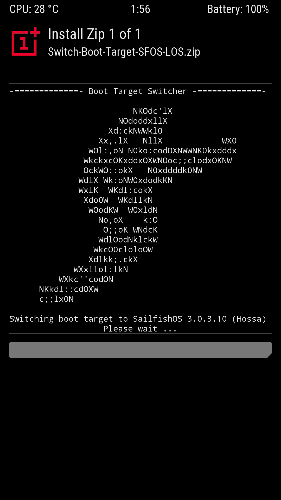
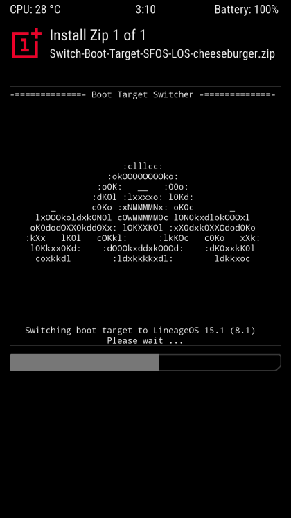

# boot-switcher
A simple flashable zip to switch between LineageOS and Sailfish OS boots specialized for cheeseburger (OnePlus 5) & dumpling (OnePlus 5T) devices by default.

Feel free to fork and adapt (see guide below the screenshots) to your device's needs! ^^

### Screenshots

### Adaptation guide

To make a flashable, package the `boot-switcher` directory **contents** inside this repo into a zip. Usually I prefer to use `zip -r Switch-Boot-Target-SFOS-LOS.zip .` from within a terminal when inside said directory.

**NOTICE:** Here are few things that may or may not require changes in the `update-binary` shell script on your part:

1. Variable `TARGET_DEVICES`: Change your device(s) codename(s) to be the [value of this variable](https://git.io/Je2kB) (multiple devices are seperated by spaces) e.g. for the OnePlus 7 Pro alone it should be `TARGET_DEVICES="guacamole"`
2. Treble: On some devices the `/vendor` partition may be something else such as `/odm`, or alternatively on older bases such as `14.1` it wouldn't be present. Remove / modify [the check part](https://git.io/Je2kz) from your script as needed. Changing the error message is also approperiate :)
3. Boot partition: [The boot partition path](https://git.io/Je2kr) (`/dev/block/bootdevice/by-name/boot`) may need to be replaced to match your device needs. This could also be an absolute partition like `/dev/block/sde19` etc
